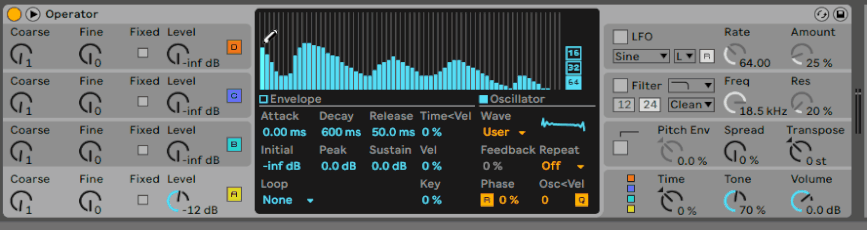
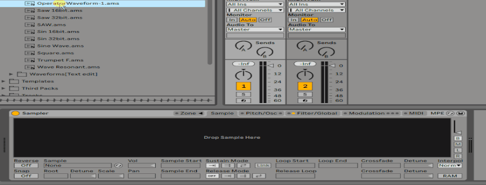

## Description
This pack is a collection of AMS files created in a way not published by Ableton; AMS files are additive synthetic waveforms generated from Operator.

It contains waveforms re-synthesised from single cycle waveforms taken from vintage digital synthesisers and Wavetable. Included are waveforms for Sampler, which contain phase information from the original waveforms, and waveforms for Operator, which do not contain phase information. When both are imported into Sampler, there is no significant difference in sound, but in Operator the partials are configured differently.

AMS files can be converted to Wav files in various formats for samplers or Wavetable, e.g. Elektron's Samplers or UDO Super6.
### Requirements
Ableton Live
### Included
- 368 ams files + Presets for Ableton Operator

## What is ams file
***ams file*** = ableton meta sound(contains a microtonal, additive synthesis waveform which can be created by Operator)

ams files are also available for simpler / sampler. They can also be imported into sampler and used as a two-operator FM/AM synth.
