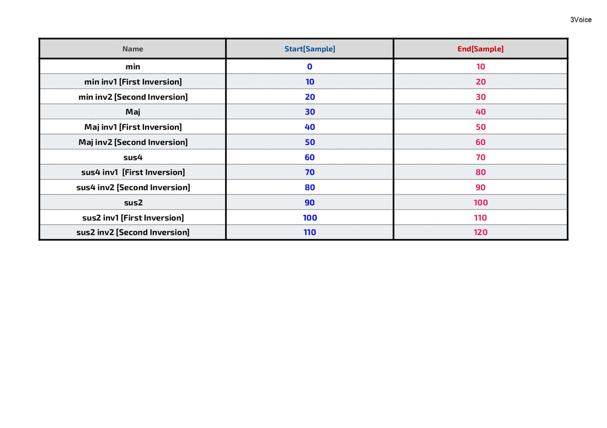
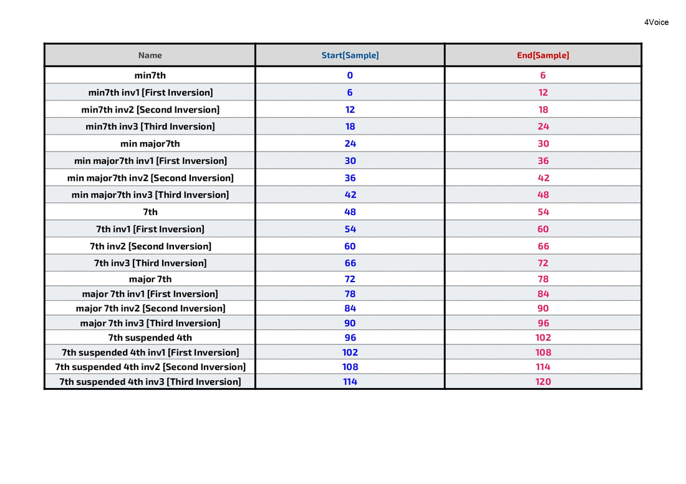
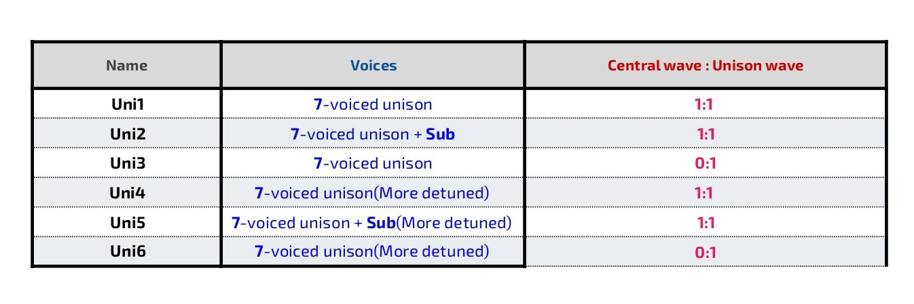

## Description 

Digital Oscillator Pack is a collection of special single cycle waveforms in three categories.Sampler can be used as an oscillator by looping the entire waveform. The waveform is tuned to note C.
___
Also included are Chord Chains and Morphing Waves optimized for Digitakt2's Grid machine; Chord Chains allow for easy chord switching, and Morphing Waves can be used as Wavetables.
### Requirements
Requirement : Sampler, Analog Rytm, Digitakt2, model:samples

### Included
Format : 48KHz-32bit-Wav
- 74 Chord + Unison Waveform
- 152 Morphing Waves [48KHz-32bit-Wav] + 152 Morphing Waves for Digitakt2
- Chord Chains for Elektron **Digitakt2**, **Analog Rytm** and **model;samples**

## Single Cycle Chord
Sample with 32 waveforms chained for DT2 and 12 and 20 waveforms chained for AR and M:S

## Single Cycle Unison

