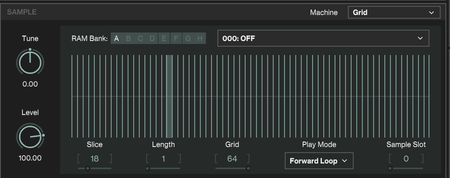

## Description
#### **Free Wavetable Collection Optimized for Digitakt2**
This pack is an optimized version of the Free Wavetables collection, specifically tailored for Elektron Digitakt2.
It features wavetables created using fundamental synthesis techniques such as FM (Frequency Modulation), PD (Phase Distortion), and Wave Shaping.
### Requirement
**Digitakt2**
### Included
- 285 wavetables
- 48kHz-32bit-Wav
- Length per one frame is Note C2
## How to use
Grid machine in Digitakt2 allows Morphing Waves to be used as a Wavetables.

