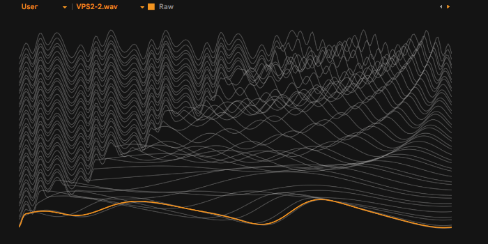

## Description 
#### Custom Wavetables + Presets
The acoustic waveforms of the M1 have been carefully tuned and re-synthesised. This pack contains not only the original waveforms, but also Wavetables with various modulation effects.

### Requirements
Requirement : Wavetable Synthesizers

### Included
- 335 Wavetables
- Ableton Live Pack[40 Presets for Ableton Wavetable]
- Enhanced Wavetables Collection [Bonus collection for purchasers of the paid Wavetable Pack]
___
### Wavetable Format
- 2048samples-44.1kHz-32bit-Wav
- 2048samples-44.1kHz-32bit-Wav[256 frames] Wavetables for Phase Plant
- 1024samples-44.1kHz-16bit-Wav Wavetables for Ableton Wavetable
- 512samples-44.1kHz-16bit-Wav
- 256samples-44.1kHz-16bit-Wav
- 128samples-44.1kHz-16bit-Wav
- 128samples-44.1kHz-16bit-Wav for Waldorf Blofeld